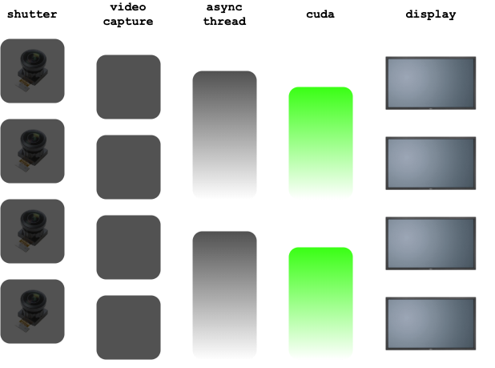

# async-tensorrt

## Overview

The challenge is trying to maintain a 30 fps camera stream when inference time alone takes 40 miliseconds. To solve this, you can create a child thread for processing frames. This allows the main thread to run without being blocked by the Cuda execution.

The code is a modification from the async exeuction in [JK Jung's TensorRT Demos](https://github.com/jkjung-avt/tensorrt_demos/blob/master/trt_ssd_async.py). In my code the main thread is responsible for Video Capture and Display, and the child thread handles inference and processing. This allows inference to execute modulus the incoming frames.

## Materials

## Procedure

### 1. Create Python thread

### 2. Initialize Cuda context inside thread

### 3. Camera capture in main thread

### 4. Queue and modulus to throttle inference

### 5. Locking and global variables

### 6. Visualize inference results from shared state

## Conclusion
